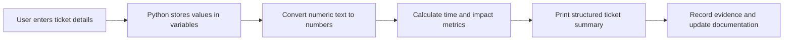

# Lab 01 — Ticket Intake Calculator

## 1. Lab Summary

**Lab:** Lab 01 — Ticket Intake Calculator  
**Primary chapter:** Automate the Boring Stuff with Python — Chapter 1: Python Basics  
**Topic area:** Python basics, command-line scripts, variables, input/output, type conversion, basic arithmetic, operational documentation  
**Difficulty:** Beginner-friendly practical lab  
**Status:** Not started / In progress / Completed

### Objective

Build a small Python command-line script that collects Service Desk ticket information, calculates impact/time metrics, and prints a clean ticket summary that could be copied into a ticketing system.

This lab is intentionally more practical than a basic syntax exercise. You are expected to combine Chapter 1 concepts into a useful operational script and explain what is happening.

---

## 2. Scenario

You work on a Service Desk and your manager wants a small script to standardise ticket intake.

Engineers currently write ticket summaries inconsistently. Some tickets are missing affected-user counts, time spent, device names, or impact information. This makes escalation harder for infrastructure teams.

Your manager gives you this requirement:

> Create a Python command-line tool that asks for key ticket details, calculates simple impact and time metrics, and prints a structured ticket summary. The tool does not need advanced validation yet, but it must clearly show how the data was collected, converted, calculated, and presented.

---

## 3. Reference Material

Use the reference material to work out the correct steps.

| Area | Suggested reference |
| --- | --- |
| Python values, expressions, variables | Automate the Boring Stuff with Python, Chapter 1 |
| `print()` and `input()` | Automate the Boring Stuff with Python, Chapter 1 |
| Type conversion with `int()`, `float()`, `str()` | Automate the Boring Stuff with Python, Chapter 1 |
| Numbers, strings, and objects | Learning Python |
| Variables as name references | Learning Python |
| Reading tracebacks | Python documentation / Automate Chapter 1 examples |
| Optional preview: `if`, `elif`, `else` | Automate the Boring Stuff with Python, Chapter 2 |

---

## 4. Requirements

| ID | Requirement | Status |
| --- | --- | --- |
| R1 | Create a Python file called `ticket_intake_calculator.py` | Not started |
| R2 | Ask for engineer name, user name, department, hostname, and issue summary | Not started |
| R3 | Ask for affected users, minutes spent, estimated additional minutes, and business impact score | Not started |
| R4 | Convert numeric input into numbers before doing arithmetic | Not started |
| R5 | Calculate total estimated minutes | Not started |
| R6 | Calculate total estimated hours | Not started |
| R7 | Calculate impact workload score | Not started |
| R8 | Calculate issue summary character count using `len()` | Not started |
| R9 | Print a clean, professional ticket summary | Not started |
| R10 | Test the script with at least three different inputs | Not started |
| R11 | Record what happens when bad input is entered | Not started |
| R12 | Document the lab in a short README or lab notes file | Not started |

---

## 5. Constraints

You must not:

* use external Python libraries
* use functions you define yourself in the core lab
* use lists, dictionaries, classes, or file handling in the core lab
* hard-code all the ticket data instead of asking the user
* skip testing with bad input
* commit secrets, private data, company data, screenshots with sensitive information, or book PDFs/EPUBs

For the core lab, use only Chapter 1-level Python:

```python
print()
input()
len()
str()
int()
float()
variables
comments
basic arithmetic operators
string concatenation
```

The optional stretch task may use simple `if`, `elif`, and `else` from Chapter 2.

---

## 6. Assumptions

Record your assumptions here.

Examples:

* This is a learning script, not a production ticketing integration.
* The script is run manually from the terminal.
* The user enters reasonable numeric values during normal operation.
* Bad input handling will be improved in a later chapter.
* The script does not connect to a real ticketing system.

---

## 7. Expected Project Structure

Create this structure inside your local working folder:

```text
lab-01-ticket-intake-calculator/
├── README.md
├── ticket_intake_calculator.py
└── evidence/
    ├── successful-run.txt
    └── bad-input-run.txt
```

You may use screenshots instead of `.txt` files if preferred, but do not include sensitive information.

---

## 8. Deliverables

By the end of the lab, your folder should contain:

| File | Purpose |
| --- | --- |
| `ticket_intake_calculator.py` | Main Python script |
| `README.md` | Short explanation of what the script does and what you learned |
| `evidence/successful-run.txt` | Evidence of at least one successful run |
| `evidence/bad-input-run.txt` | Evidence or notes showing what happened with bad input |

---

## 9. Implementation Tasks

Use these tasks as a guide, not as a full walkthrough.

### Task 1 — Create the Script

Create a Python file called:

```text
ticket_intake_calculator.py
```

Verify that you can run it from the terminal.

Useful commands may include:

```powershell
python --version
python ticket_intake_calculator.py
```

or:

```powershell
py ticket_intake_calculator.py
```

---

### Task 2 — Collect Ticket Information

Your script must ask for:

```text
Engineer name
User name
Department
Device hostname
Issue summary
Number of affected users
Minutes already spent troubleshooting
Estimated additional minutes needed
Business impact score from 1 to 5
```

Remember: `input()` returns text, even if the user types a number.

You will need to convert some values with:

```python
int()
float()
```

---

### Task 3 — Calculate Ticket Metrics

Your script must calculate:

| Metric | Formula |
| --- | --- |
| Total estimated minutes | minutes already spent + estimated additional minutes |
| Total estimated hours | total estimated minutes / 60 |
| Impact workload score | affected users * business impact score |
| Issue summary character count | `len(issue_summary)` |

---

### Task 4 — Print a Clean Ticket Summary

Your output should be readable and professional.

Example style:

```text
==============================
SERVICE DESK TICKET SUMMARY
==============================

Engineer: Nik
User: John Smith
Department: Finance
Device: LAPTOP-4421

Issue Summary:
User cannot access internal payroll system.

Affected Users: 3
Business Impact Score: 4
Impact Workload Score: 12

Troubleshooting Time So Far: 25 minutes
Estimated Additional Time: 35 minutes
Total Estimated Time: 60 minutes
Total Estimated Hours: 1.0

Issue Summary Character Count: 43

Initial Ticket Note:
Nik is investigating an issue for John Smith in Finance on device LAPTOP-4421.
The issue affects 3 user(s) and has a business impact score of 4.
```

---

### Task 5 — Add Explanation Comments

Add comments to your Python file answering these questions:

```python
# Why does input() return text even when the user types a number?
# Why do we need int() or float() before doing maths?
# What happens if you try to add "5" + 5?
# What is the difference between 60 / 30 and 60 // 30?
# Why might len(issue_summary) be useful in a real Service Desk environment?
```

You may need to test or research these yourself.

---

### Task 6 — Test Valid Inputs

Run your script at least twice with valid input.

Test 1:

```text
Affected users: 1
Impact score: 2
Minutes spent: 10
Additional minutes: 20
```

Expected:

```text
Total time: 30 minutes
Total hours: 0.5
Impact workload score: 2
```

Test 2:

```text
Affected users: 12
Impact score: 5
Minutes spent: 45
Additional minutes: 75
```

Expected:

```text
Total time: 120 minutes
Total hours: 2.0
Impact workload score: 60
```

---

### Task 7 — Test Bad Input

Enter text where a number is expected.

Example:

```text
Affected users: five
```

The script will probably crash. That is acceptable for this lab.

Record:

* what error appeared
* what line caused the issue
* why Python could not convert the value
* how this might be improved in a later lab

---

## 10. Chapter 2 Preview Stretch Task

Only do this after completing the core lab.

Add a simple priority label using `if`, `elif`, and `else`.

Use the impact workload score:

| Score | Priority |
| --- | --- |
| 0–9 | Low |
| 10–24 | Medium |
| 25–49 | High |
| 50+ | Critical |

Example logic:

```python
if impact_workload_score >= 50:
    priority = "Critical"
elif impact_workload_score >= 25:
    priority = "High"
elif impact_workload_score >= 10:
    priority = "Medium"
else:
    priority = "Low"
```

Print:

```text
Suggested Priority: Critical
```

This is a preview of the next chapter, not the main focus.

---

## 11. Key Commands Used

Record the important commands you used.

| Command | Purpose |
| --- | --- |
| `python --version` | Verify Python is installed |
| `python ticket_intake_calculator.py` | Run the script |
| `git status` | Check repository state |
| `git add .` | Stage changes |
| `git diff --staged` | Review staged changes |
| `git commit -m "message"` | Commit the lab work |

Add or remove commands based on what you actually used.

---

## 12. Files Created or Changed

| Path | Purpose |
| --- | --- |
| `ticket_intake_calculator.py` | Main script |
| `README.md` | Lab documentation |
| `evidence/successful-run.txt` | Evidence of successful test run |
| `evidence/bad-input-run.txt` | Evidence of bad input test |

---

## 13. Verification Evidence

| Check | Evidence | Result |
| --- | --- | --- |
| Python available | `python --version` returned a version | Passed / Failed |
| Script runs | Script starts and asks for input | Passed / Failed |
| Numeric conversion works | Valid numeric inputs produce correct calculations | Passed / Failed |
| Total minutes correct | Test cases return expected total minutes | Passed / Failed |
| Total hours correct | Test cases return expected total hours | Passed / Failed |
| Workload score correct | Test cases return expected impact workload score | Passed / Failed |
| Bad input tested | Entering text for a number produced an error you recorded | Passed / Failed |
| Documentation completed | README or notes explain the lab | Passed / Failed |

---

## 14. Diagram

Use this diagram to describe the basic flow.



---

## 15. Issues Encountered

Record any mistakes, errors, or blockers.

| Issue | Cause | Fix or note |
| --- | --- | --- |
|  |  |  |

If there were no issues, write:

> No major issues encountered.

---

## 16. Decisions Made

Record important technical decisions.

| Decision | Reason |
| --- | --- |
| Use a command-line script | It keeps the lab simple and focused on Python basics |
| Convert numeric input with `int()` or `float()` | `input()` returns strings, so arithmetic needs conversion |
| Keep bad input handling for a later lab | Exception handling and validation belong to later topics |
| Use ticket impact as the scenario | It connects beginner Python to real Service Desk/SRE workflows |

---

## 17. Security and Production Considerations

In production, ticket data may contain personal information or internal system details.

Consider:

* do not commit real user names, hostnames, screenshots, or company data
* do not store sensitive ticket content in public repositories
* validate numeric input before trusting it
* avoid hard-coding real business data
* add error handling before using a tool with other engineers
* log carefully if the tool ever becomes persistent or shared

---

## 18. Final Outcome

State clearly whether the lab was completed.

Example:

> The lab was completed successfully. I built a Python command-line script that collects ticket information, converts numeric input, calculates total estimated time and workload impact, prints a structured summary, and records evidence of successful and failed input tests.

---

## 19. What I Learned

Write 3–6 bullet points.

Examples:

* I learned that `input()` returns a string.
* I learned why `int()` and `float()` are needed before arithmetic.
* I learned how Python reports conversion errors with tracebacks.
* I learned how to combine variables, strings, and arithmetic into a practical script.
* I learned how simple scripts can improve ticket quality and operational consistency.

---

## 20. What I Would Improve in Production

Write 2–5 bullet points.

Examples:

* Add input validation.
* Add error handling with `try` and `except`.
* Save ticket summaries to a file.
* Add tests for calculation logic.
* Integrate with a real ticketing API later.

---

## 21. References Used

List the references you actually used.

| Reference | Used for |
| --- | --- |
| Automate the Boring Stuff with Python, Chapter 1 | Python basics, input/output, type conversion |
| Learning Python | numbers, strings, variables, objects |
| Python documentation | tracebacks and built-in functions |
| Automate the Boring Stuff with Python, Chapter 2 | Optional `if`/`elif`/`else` stretch task |

---

## 22. Completion Checklist

* [ ] Python version checked
* [ ] Script file created
* [ ] All required inputs collected
* [ ] Numeric inputs converted correctly
* [ ] Total minutes calculated
* [ ] Total hours calculated
* [ ] Impact workload score calculated
* [ ] Issue summary character count calculated
* [ ] Clean ticket summary printed
* [ ] Valid test case 1 completed
* [ ] Valid test case 2 completed
* [ ] Bad input test completed
* [ ] Explanation comments added
* [ ] README or notes completed
* [ ] No private/company data committed
* [ ] Work committed with a clear message

---

## 23. Reflection Questions

Answer these after completing the lab.

1. Why does `input()` return a string?
2. What is the difference between a string and an integer?
3. Why does `"5" + 5` fail?
4. When would you choose `int()` instead of `float()`?
5. What does `len()` count when used on a string?
6. Why is bad input dangerous in operational tools?
7. How could this script improve ticket quality?
8. What information should not be stored in a public repository?
9. What would make this script unreliable in production?
10. Which part of the script would be easiest to test later?
